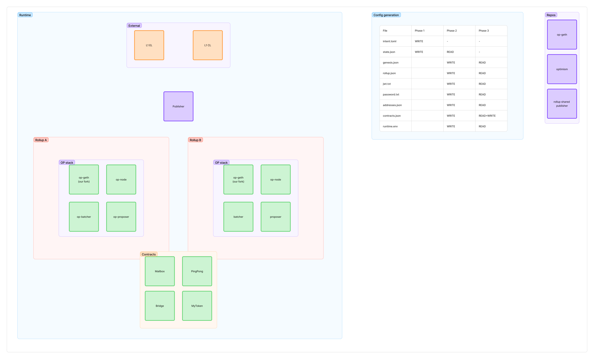

# L2 Network Command

The `localnet l2` command manages Layer 2 rollup networks built on the OP Stack.

## Architecture



## What It Does

The L2 command orchestrates a complete rollup deployment in three phases:

### Phase 1: L1 Contract Deployment
Deploys OP Stack contracts to L1 using `op-deployer`:
- System Config
- L1 Standard Bridge
- L1 Cross Domain Messenger
- OptimismPortal
- DisputeGameFactory
- And other core contracts

### Phase 2: Configuration Generation
Generates configuration files for each L2 chain:
- `genesis.json` - Initial blockchain state
- `rollup.json` - Rollup configuration
- `jwt-secret.txt` - Authentication between services

### Phase 3: Runtime Deployment
Starts L2 services using Docker Compose:
- **op-geth**: Execution client for each rollup
- **op-node**: Consensus/derivation client
- **op-batcher**: Batches transactions to L1
- **op-proposer**: Proposes output roots to L1
- **Publisher**: Publishes superblocks to L1

Deploys Compose-specific contracts to L2:
- Dispute settlement contracts
- Verification contracts

## Prerequisites

- **Foundry/Forge**: For Solidity compilation
- **just**: Command runner for contract scripts
- **jq**: JSON processor for deployment scripts
- **Docker**: For running L2 services

## Configuration

All L2 settings are configured in `configs/config.yaml`. See [example config](../../configs/config.yaml) for all available options.

**Required settings:**
- L1 connection (chain ID, EL URL, CL URL)
- Wallet credentials (private key, address)
- Coordinator credentials
- Compose network name
- Dispute game settings (addresses, vkeys, explorer URLs)

## Usage

### Running L2 Networks

```bash
# Start L2 deployment (all phases)
make run-l2

# Or run directly
./cmd/localnet/bin/localnet l2

# Show running services
make show-l2

# Clean up
make clean-l2
```

### Local Development

For rapid iteration on local changes to `op-geth` or `publisher`, use local repository paths:

```yaml
# configs/config.yaml
repositories:
  op-geth:
    local-path: ../op-geth  # Relative path
  publisher:
    local-path: ~/projects/publisher  # Absolute path with ~
```

Rebuild and restart specific services after code changes:

```bash
# Rebuild and restart publisher service only
make l2-deploy SERVICE=publisher

# Rebuild and restart op-geth services only
make l2-deploy SERVICE=op-geth

# Rebuild and restart all services
make l2-deploy SERVICE=all
```

This skips full redeployment (Phase 1-2) and only rebuilds Docker images + restarts containers.

### Compiling Contracts

```bash
# Compile contracts from compose-contracts repository
make run-l2-compile

# Or run directly
./cmd/localnet/bin/localnet l2 compile
```

This generates `contracts.json` in `.localnet/compiled-contracts/`. To embed in binary, copy to `internal/l2/l2runtime/contracts/compiled/` and commit.

### Docker Usage

For running in Docker, see the [Docker documentation](../../build/DOCKER.md) and example scripts:
- `docker-run-l2-hoodi-example.sh` - Generic template

For more details, see the [main README](../../README.md) or [Docker documentation](../../build/DOCKER.md).
